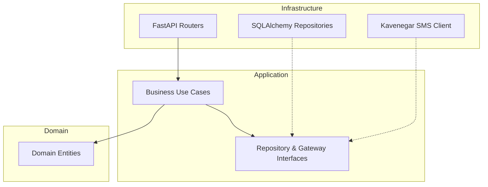

# Project Refactor Context: Hafte-Yar (هفته‌یار)

This document provides a comprehensive technical overview of the **Hafte-Yar** system. It is designed to serve as a complete reference for rebuilding, refactoring, or migrating the system in a new repository from scratch.

---

## Project Overview

### Purpose of the System
**Hafte-Yar (هفته‌یار)** is a collaborative team task management system. Its core goal is to simplify planning, track tasks, and facilitate team coordination. The system is designed to be highly accessible, enabling users to interact with their tasks not only through a web application but also directly via messaging platform bots (Telegram and Bale).

### Main Business Domain
1. **Task Management**: Managing task lifecycles across projects and project lists (Kanban-style columns).
2. **Team Management**: Handling team creation, user roles (Owner, Admin, Member), and invitations.
3. **Chat Integration**: Automating account linking, registration, and task operations directly inside instant messaging platforms via webhook endpoints.
4. **AI Processing (Future)**: Processing multimedia inputs (voice, whiteboard images, video) to auto-generate and assign structured tasks.

### Current Implementation Status
- The core database models and REST API layer are completed.
- OTP auth verification via SMS (Kavenegar gateway or console logger) is implemented.
- Telegram and Bale bot webhook endpoints with an adapter design pattern are functional.
- The command parsing pipeline in `services/message_service.py` is implemented and verified by integration tests.
- Provisioning of default project and default lists ("انجام نشده", "در حال انجام", "انجام شده") is automatically handled during team creation to enable immediate task management via bot commands.

---

## Technology Stack

- **Language**: Python 3.12+
- **Web Framework**: FastAPI (v0.111.0+)
- **ASGI Server**: Uvicorn (v0.30.0+)
- **ORM / Database Engine**: SQLAlchemy (v2.0.30+)
- **Database**: SQLite (default connection strings target `./haftyar.db`)
- **Settings & Validation**: Pydantic (v2.7.4+) and Pydantic Settings (v2.3.1+)
- **Security & Cryptography**: 
  - `bcrypt` / `passlib` (for hashing verification codes)
  - `python-jose[cryptography]` (for JWT generation and validation)
- **HTTP Client**: HTTPX (v0.27.0+) (for sending outgoing replies to Telegram/Bale bot APIs and invoking the Kavenegar SMS API)
- **SMS Gateway**: Kavenegar (for production OTP sending via templates/SMS)

---

## Directory Structure

```
haftyar-backend-v0.3/
├── api/
│   └── v1/
│       ├── webhooks/
│       │   ├── adapters/
│       │   │   ├── bale.py
│       │   │   ├── base.py
│       │   │   └── telegram.py
│       │   ├── router.py
│       │   └── schemas.py
│       ├── auth.py
│       ├── lists.py
│       ├── projects.py
│       ├── router.py
│       ├── tasks.py
│       ├── teams.py
│       └── users.py
├── app/                      # Symlink / Junction pointing to root (.)
├── core/
│   ├── config.py
│   ├── deps.py
│   ├── ids.py
│   ├── phone.py
│   └── security.py
├── database/
│   ├── base.py
│   └── session.py
├── models/
│   ├── __init__.py
│   ├── otp_models.py
│   ├── project_models.py
│   ├── task_models.py
│   ├── team_models.py
│   └── user_models.py
├── schemas/
│   ├── auth_schemas.py
│   ├── list_schemas.py
│   ├── project_schemas.py
│   ├── task_schemas.py
│   ├── team_schemas.py
│   └── user_schemas.py
├── services/
│   ├── __init__.py
│   ├── access.py
│   ├── auth_service.py
│   ├── list_service.py
│   ├── message_service.py
│   ├── otp_service.py
│   ├── project_service.py
│   ├── sms_service.py
│   ├── task_service.py
│   ├── team_service.py
│   └── user_service.py
├── main.py
├── requirements.txt
├── test_webhook.py
└── .env
```

### Responsibilities of Each Layer
- **`api/v1/`**: Receives incoming requests, validates payloads using Pydantic schemas, runs FastAPI dependencies (e.g. database sessions, authentication), delegates tasks to the service layer, and returns JSON serialization outputs.
- **`api/v1/webhooks/`**: Receives raw message events from Bale and Telegram, uses platform-specific adapters to normalize payloads into `InternalMessage` objects, and enqueues background processing.
- **`services/`**: Houses all business logic. No raw database manipulation is exposed outside services. Services read/write data directly through SQLAlchemy engine sessions.
- **`services/access.py`**: A specialized central layer enforcing security, subscription validity, and user role authorizations (MEMBER, ADMIN, OWNER) for teams, projects, and tasks.
- **`models/`**: Defines database tables and SQLAlchemy relationships.
- **`schemas/`**: Defines Pydantic validation rules and serializer formats for inputs/outputs.
- **`core/`**: Provides global utilities such as JWT generation, normalization, configuration loading, and custom unique ID generation.

---

## System Architecture

### Request Flow (REST API)
```
[Client App] ──(HTTP JSON)──> [FastAPI Router] ──(Pydantic Validation)──> [Access Layer / Service] ──(SQLAlchemy)──> [SQLite DB]
```

### Webhook Event Processing Flow
```
[Telegram/Bale] ─(HTTP POST)─> [Webhook Router] ──> [Platform Adapter] ──(Parse & Normalize)──> [InternalMessage]
                                                                                                    │
[Client Reply] <──(HTTPX POST)── [Background Processing Task] <──(Enqueued via FastAPI background)──┘
```
1. **Ingestion**: Chat bots post events to `/api/v1/webhooks/{platform}`.
2. **Parsing**: The matching adapter (`TelegramAdapter` or `BaleAdapter`) extracts the sender, message ID, content, timestamp, and any shared contact card.
3. **Immediate Acknowledgement**: The endpoint schedules the processing logic in a FastAPI background task and immediately returns `200 OK` (with status `accepted` or `ignored`) to prevent platforms from retrying.
4. **Background Execution**: The background worker:
   - Evaluates the message ID against an in-memory `IdempotencyCache` to ignore duplicates.
   - Determines if the platform user ID is linked to an existing account.
   - If **unlinked** and sharing their contact: registers/links the user and returns a web login token.
   - If **unlinked** and not sharing contact: requests sharing of their phone number using native keyboard configurations.
   - If **linked**: processes bot slash commands (e.g., `/create_task`, `/teams`) and dispatches the execution logic to core services.
   - Sends replies back to the user via Telegram/Bale bot APIs.

---

## Database Design

All database tables (except `otp_verifications`) use custom string identifiers generated by [core/ids.py](file:///E:/Abumahdi/1404-02-Summer/TorshizAI/Hafte-Yar/phase1/develop/haftyar-backend-v0.3/core/ids.py).

### 1. `users` Table
- **Purpose**: Stores user profile records.
- **Columns**:
  - `id` (String(32), Primary Key): Defaults to `new_user_id` (format: `usr_` + url-safe token).
  - `username` (String, Unique, Nullable, Indexed)
  - `email` (String, Unique, Nullable, Indexed)
  - `phone` (String(11), Unique, Nullable, Indexed): Normalized Iranian phone number (e.g. `09123456789`).
  - `created_at` (DateTime): Default `datetime.utcnow`.
- **Relationships**:
  - `accounts`: One-to-many relationship with `UserAccount` (cascade delete-orphan).
  - `team_memberships`: One-to-many with `TeamMember`.
  - `tasks_assigned`: One-to-many with `TaskAssignee`.

### 2. `user_accounts` Table
- **Purpose**: Connects users to login providers (phone number or external messaging integrations like Bale or Telegram).
- **Columns**:
  - `id` (String(32), Primary Key): Defaults to `new_account_id` (format: `acc_` + url-safe token).
  - `user_id` (String(32), ForeignKey("users.id"), Nullable=False, Indexed)
  - `provider` (String, Nullable=False, Indexed): e.g. `"telegram"`, `"bale"`, or `"phone"`.
  - `provider_id` (String, Nullable=False, Indexed): Platform-specific identifier (e.g., Telegram user ID or phone number).
- **Relationships**:
  - `user`: Many-to-one relationship back to `User`.

### 3. `otp_verifications` Table
- **Purpose**: Stores active OTP codes. Records are deleted immediately upon successful verification or expiry.
- **Columns**:
  - `id` (Integer, Primary Key, Indexed): Auto-incrementing.
  - `phone` (String(11), Nullable=False, Indexed)
  - `code_hash` (String, Nullable=False): Bcrypt hashed OTP code.
  - `purpose` (Enum, Nullable=False): `OtpPurpose` enum values (`"REGISTER"`, `"LOGIN"`).
  - `expires_at` (DateTime, Nullable=False)
  - `created_at` (DateTime, Nullable=False): Default `datetime.utcnow`.
  - `attempts` (Integer, Nullable=False): Default `0`. Tracks failed attempts.

### 4. `teams` Table
- **Purpose**: Manages group boundaries.
- **Columns**:
  - `id` (String(32), Primary Key): Defaults to `new_team_id` (format: `tm_` + url-safe token).
  - `name` (String, Nullable=False)
  - `created_at` (DateTime): Default `datetime.utcnow`.
  - `subscription_expiry` (DateTime): Default `datetime.utcnow` + 30 days.
  - `is_active` (Boolean): Default `True`.
- **Relationships**:
  - `members`: One-to-many with `TeamMember` (cascade delete-orphan).
  - `projects`: One-to-many with `Project` (cascade delete-orphan).

### 5. `team_members` Table
- **Purpose**: Map users to teams with specific roles.
- **Columns**:
  - `id` (String(32), Primary Key): Defaults to `new_member_id` (format: `mbr_` + url-safe token).
  - `team_id` (String(32), ForeignKey("teams.id"), Nullable=False, Indexed)
  - `user_id` (String(32), ForeignKey("users.id"), Nullable=False, Indexed)
  - `role` (Enum, Nullable=False): `TeamRole` values (`"OWNER"`, `"ADMIN"`, `"MEMBER"`). Default is `"MEMBER"`.
- **Relationships**:
  - `team`: Many-to-one back to `Team`.
  - `user`: Many-to-one back to `User`.

### 6. `projects` Table
- **Purpose**: Stores task scopes/projects under teams.
- **Columns**:
  - `id` (String(32), Primary Key): Defaults to `new_project_id` (format: `prj_` + url-safe token).
  - `team_id` (String(32), ForeignKey("teams.id"), Nullable=False, Indexed)
  - `name` (String, Nullable=False)
  - `description` (Text, Nullable=True)
  - `created_at` (DateTime, Nullable=False): Default `datetime.utcnow`.
  - `updated_at` (DateTime, Nullable=False): Default `datetime.utcnow` with `onupdate=datetime.utcnow`.
- **Relationships**:
  - `team`: Many-to-one back to `Team`.
  - `lists`: One-to-many with `ProjectList` (cascade delete-orphan).

### 7. `project_lists` Table
- **Purpose**: Stores list columns inside projects (Kanban columns).
- **Columns**:
  - `id` (String(32), Primary Key): Defaults to `new_list_id` (format: `lst_` + url-safe token).
  - `project_id` (String(32), ForeignKey("projects.id"), Nullable=False, Indexed)
  - `name` (String, Nullable=False)
  - `position` (Integer, Nullable=False): Default `0`.
  - `created_at` (DateTime, Nullable=False): Default `datetime.utcnow`.
- **Relationships**:
  - `project`: Many-to-one back to `Project`.

### 8. `tasks` Table
- **Purpose**: Stores task items.
- **Columns**:
  - `id` (String(32), Primary Key): Defaults to `new_task_id` (format: `tsk_` + url-safe token).
  - `title` (String, Nullable=False)
  - `description` (Text, Nullable=True)
  - `status` (Enum, Nullable=False): `TaskStatus` values (`"TODO"`, `"IN_PROGRESS"`, `"DONE"`). Default is `"TODO"`.
  - `due_date` (DateTime, Nullable=True)
  - `priority` (Integer, Nullable=False): Default `0`.
  - `list_id` (String(32), ForeignKey("project_lists.id"), Nullable=False)
  - `project_id` (String(32), ForeignKey("projects.id"), Nullable=False)
  - `creator_id` (String(32), ForeignKey("users.id"), Nullable=True)
  - `created_at` (DateTime): Default `datetime.utcnow`.
- **Relationships**:
  - `assignees`: One-to-many with `TaskAssignee` (cascade delete-orphan).
  - `comments`: One-to-many with `TaskComment` (cascade delete-orphan).

### 9. `task_assignees` Table
- **Purpose**: Maps users assigned to tasks.
- **Columns**:
  - `id` (String(32), Primary Key): Defaults to `new_assignee_id` (format: `asn_` + url-safe token).
  - `task_id` (String(32), ForeignKey("tasks.id"), Nullable=False)
  - `user_id` (String(32), ForeignKey("users.id"), Nullable=False)
- **Relationships**:
  - `task`: Many-to-one back to `Task`.
  - `user`: Many-to-one back to `User`.

### 10. `task_comments` Table
- **Purpose**: Stores discussion messages and attachments associated with tasks.
- **Columns**:
  - `id` (String(32), Primary Key): Defaults to `new_comment_id` (format: `cmt_` + url-safe token).
  - `task_id` (String(32), ForeignKey("tasks.id"), Nullable=False)
  - `user_id` (String(32), ForeignKey("users.id"), Nullable=False)
  - `content` (Text, Nullable=False)
  - `media_url` (String, Nullable=True)
  - `media_type` (String, Nullable=True)
  - `created_at` (DateTime): Default `datetime.utcnow`.
- **Relationships**:
  - `task`: Many-to-one back to `Task`.

---

## Domain Models & Business Rules

### 1. User Account Linking
- A `User` can bind multiple `UserAccount` credentials (e.g. one for phone auth, one for Telegram, one for Bale).
- Linking credentials requires normalized phone number mapping to confirm identity.

### 2. Team Subscriptions & Status
- Every `Team` has `is_active` (boolean) and `subscription_expiry` (DateTime).
- **Rule**: If `is_active` is `False` or if `subscription_expiry` has passed, all team actions (modifying projects, lists, tasks) are blocked with `403 Forbidden`. The subscription validity check is computed dynamically:
  ```python
  def is_subscription_valid(self):
      return datetime.utcnow() < self.subscription_expiry and self.is_active
  ```

### 3. Role-Based Access Control
- `OWNER`: Assigned to the team creator. Has administrative permissions, including team deletion. An Owner's role cannot be changed, and they cannot be removed from the team.
- `ADMIN`: Can add members, update roles, manage projects, and manage task lists.
- `MEMBER`: Has read-only permissions for team directories, but can update, create, or assign tasks depending on the task configuration.

### 4. Default Team Workspace Creation
- When a new team is created, the system automatically provisions:
  - A default project named `"پروژه عمومی"` (Public Project).
  - Default task lists: `"انجام نشده"` (position 0), `"در حال انجام"` (position 1), and `"انجام شده"` (position 2).
- This structure ensures that chat bot interactions can immediately create tasks without requiring manual project setup.

---

## Authentication & Authorization

### Authentication Flows
1. **SMS OTP Request**:
   - Endpoints: `/auth/register/send-otp` and `/auth/login/send-otp`.
   - Validates that the user registration state matches the requested endpoint (registration rejects existing numbers with `409 Conflict`; login rejects non-existent numbers with `404 Not Found`).
   - Generates a 6-digit cryptographically random code (`secrets.randbelow(1_000_000)`).
   - Hashes code using bcrypt and saves to `otp_verifications` with expiration (5 mins).
   - Triggers SMS delivery using the Kavenegar HTTP API (or logs to console in dev).
2. **OTP Verification**:
   - Endpoints: `/auth/register/verify-otp` and `/auth/login/verify-otp`.
   - Checks rate-limits (maximum 5 failed attempts) and expiration.
   - Deletes OTP record on success to prevent reuse.
   - Returns a JWT access token. If registering, automatically creates a default user (`user_{phone}`) and a corresponding `"phone"` provider `UserAccount`.
3. **Bot Passwordless Login Link**:
   - When a user interacts with Telegram/Bale bots (`/start` or `/help`), the system generates a JWT signed with the team secret key.
   - Generates a callback link: `{FRONTEND_URL}/login/callback?token={token}`.
   - This link enables passwordless browser login from the messaging app.

### Token Specification
- **Algorithm**: HMAC SHA256 (`HS256`).
- **Standard Payload**:
  - `sub`: The internal user ID (e.g. `usr_...`).
  - `exp`: UTC expiration timestamp (default: 7 days).

---

## API Documentation

All versioned REST endpoints are prefixed with `/api/v1`. Accessing endpoints marked with **[Protected]** requires a Bearer JWT header: `Authorization: Bearer <JWT>`.

### Auth Endpoints
- `POST /auth/register/send-otp`
  - *Purpose*: Initiates registration by sending a verification code.
  - *Request*: `SendOtpRequest` (`phone`: str)
  - *Response*: `SendOtpResponse` (`message`: str, `expires_in_seconds`: int, `dev_code`: str | None)
- `POST /auth/register/verify-otp`
  - *Purpose*: Verifies OTP and registers user.
  - *Request*: `VerifyOtpRequest` (`phone`: str, `code`: str)
  - *Response*: `TokenResponse` (`access_token`: str, `token_type`: str, `is_new_user`: bool)
- `POST /auth/login/send-otp`
  - *Purpose*: Initiates login by sending a verification code.
  - *Request*: `SendOtpRequest` (`phone`: str)
  - *Response*: `SendOtpResponse`
- `POST /auth/login/verify-otp`
  - *Purpose*: Verifies OTP and returns access token.
  - *Request*: `VerifyOtpRequest` (`phone`: str, `code`: str)
  - *Response*: `TokenResponse`

### User Endpoints
- `GET /users/me` **[Protected]**
  - *Purpose*: Retrieves profile of authenticated user.
  - *Response*: `UserOut` (`id`: str, `username`: str | None, `email`: str | None, `phone`: str | None, `created_at`: datetime)
- `PATCH /users/me` **[Protected]**
  - *Purpose*: Updates user profile.
  - *Request*: `UserUpdate` (`username`: str | None, `email`: str | None, `phone`: str | None)
  - *Response*: `UserOut`
- `POST /users/me/accounts` **[Protected]**
  - *Purpose*: Links a social provider (e.g., telegram/bale).
  - *Request*: `UserAccountCreate` (`provider`: str, `provider_id`: str)
  - *Response*: `UserAccountOut`
- `GET /users/me/accounts` **[Protected]**
  - *Purpose*: Lists linked social provider accounts (excluding primary `"phone"` / `"password"` types).
  - *Response*: `list[UserAccountOut]`
- `GET /users/{user_id}` **[Protected]**
  - *Purpose*: Gets user profile details by ID.
  - *Response*: `UserOut`

### Team Endpoints
- `POST /teams` **[Protected]**
  - *Purpose*: Creates a new team and provisions default workspace.
  - *Request*: `TeamCreate` (`name`: str)
  - *Response*: `TeamOut` (`id`: str, `name`: str, `created_at`: datetime, `subscription_expiry`: datetime, `is_active`: bool, `subscription_valid`: bool)
- `GET /teams` **[Protected]**
  - *Purpose*: Lists teams of the authenticated user.
  - *Query Parameters*: `limit` (int, default 50), `offset` (int, default 0)
  - *Response*: `list[TeamOut]`
- `GET /teams/{team_id}` **[Protected]**
  - *Purpose*: Retrieves details of a team.
  - *Response*: `TeamOut`
- `PATCH /teams/{team_id}` **[Protected]**
  - *Purpose*: Updates team properties (e.g., toggles subscription activity).
  - *Request*: `TeamUpdate` (`name`: str | None, `is_active`: bool | None)
  - *Response*: `TeamOut` (Requires Admin/Owner privileges).
- `DELETE /teams/{team_id}` **[Protected]**
  - *Purpose*: Deletes a team.
  - *Response*: `{"ok": True}` (Requires Owner privileges).

### Team Membership Endpoints
- `POST /teams/{team_id}/members` **[Protected]**
  - *Purpose*: Invites/adds a member to the team.
  - *Request*: `TeamMemberCreate` (`user_id`: str, `role`: TeamRole)
  - *Response*: `TeamMemberOut` (`id`: str, `team_id`: str, `user_id`: str, `role`: str) (Requires Admin/Owner privileges).
- `GET /teams/{team_id}/members` **[Protected]**
  - *Purpose*: Lists members of the team.
  - *Response*: `list[TeamMemberOut]`
- `PATCH /teams/{team_id}/members/{member_id}` **[Protected]**
  - *Purpose*: Modifies role of a team member.
  - *Request*: `TeamMemberUpdate` (`role`: TeamRole)
  - *Response*: `TeamMemberOut` (Requires Admin/Owner privileges. Cannot modify OWNER).
- `DELETE /teams/{team_id}/members/{member_id}` **[Protected]**
  - *Purpose*: Removes a member from the team.
  - *Response*: `{"ok": True}` (Requires Admin/Owner privileges. Cannot remove OWNER).

### Project Endpoints
- `POST /teams/{team_id}/projects` **[Protected]**
  - *Purpose*: Creates a project.
  - *Request*: `ProjectCreate` (`name`: str, `description`: str | None)
  - *Response*: `ProjectOut` (Requires Admin/Owner privileges).
- `GET /teams/{team_id}/projects` **[Protected]**
  - *Purpose*: Lists team projects.
  - *Query Parameters*: `limit` (int, default 50), `offset` (int, default 0)
  - *Response*: `list[ProjectOut]`
- `GET /projects/{project_id}` **[Protected]**
  - *Purpose*: Retrieves a project.
  - *Response*: `ProjectOut`
- `PATCH /projects/{project_id}` **[Protected]**
  - *Purpose*: Updates project details.
  - *Request*: `ProjectUpdate` (`name`: str | None, `description`: str | None)
  - *Response*: `ProjectOut` (Requires Admin/Owner privileges).
- `DELETE /projects/{project_id}` **[Protected]**
  - *Purpose*: Deletes a project.
  - *Response*: `{"ok": True}` (Requires Admin/Owner privileges).

### Project List Endpoints
- `POST /projects/{project_id}/lists` **[Protected]**
  - *Purpose*: Creates a list/column in a project.
  - *Request*: `ListCreate` (`name`: str, `position`: int)
  - *Response*: `ListOut` (`id`: str, `project_id`: str, `name`: str, `position`: int, `created_at`: datetime) (Requires Admin/Owner privileges).
- `GET /projects/{project_id}/lists` **[Protected]**
  - *Purpose*: Lists all columns inside a project, sorted by position and creation date.
  - *Response*: `list[ListOut]`
- `GET /projects/{project_id}/lists/{list_id}` **[Protected]**
  - *Purpose*: Retrieves a project list.
  - *Response*: `ListOut`
- `PATCH /projects/{project_id}/lists/{list_id}` **[Protected]**
  - *Purpose*: Updates name or position of a project list.
  - *Request*: `ListUpdate` (`name`: str | None, `position`: int | None)
  - *Response*: `ListOut` (Requires Admin/Owner privileges).
- `DELETE /projects/{project_id}/lists/{list_id}` **[Protected]**
  - *Purpose*: Deletes a project list.
  - *Response*: `{"ok": True}` (Requires Admin/Owner privileges).

### Task Endpoints
- `POST /tasks` **[Protected]**
  - *Purpose*: Creates a task.
  - *Request*: `TaskCreate` (`title`: str, `description`: str | None, `status`: TaskStatus, `due_date`: datetime | None, `priority`: int, `list_id`: str, `project_id`: str)
  - *Response*: `TaskOut`
- `GET /tasks` **[Protected]**
  - *Purpose*: Retrieves tasks with filter parameters.
  - *Query Parameters*: `project_id` (str | None), `list_id` (str | None), `limit` (int, default 50), `offset` (int, default 0)
  - *Response*: `list[TaskOut]` (If filters are omitted, returns all tasks assigned to the user across their accessible teams).
- `GET /tasks/{task_id}` **[Protected]**
  - *Purpose*: Retrieves a task.
  - *Response*: `TaskOut`
- `PATCH /tasks/{task_id}` **[Protected]**
  - *Purpose*: Updates task details.
  - *Request*: `TaskUpdate` (`title`: str | None, `description`: str | None, `status`: TaskStatus | None, `due_date`: datetime | None, `priority`: int | None, `list_id`: str | None)
  - *Response*: `TaskOut`
- `DELETE /tasks/{task_id}` **[Protected]**
  - *Purpose*: Deletes a task.
  - *Response*: `{"ok": True}`
- `POST /tasks/{task_id}/assignees` **[Protected]**
  - *Purpose*: Assigns a user to a task.
  - *Request*: `TaskAssigneeCreate` (`user_id`: str)
  - *Response*: `TaskAssigneeOut` (`id`: str, `task_id`: str, `user_id`: str)
- `GET /tasks/{task_id}/assignees` **[Protected]**
  - *Purpose*: Lists task assignees.
  - *Response*: `list[TaskAssigneeOut]`
- `DELETE /tasks/{task_id}/assignees/{assignee_id}` **[Protected]**
  - *Purpose*: Removes a task assignee.
  - *Response*: `{"ok": True}`
- `POST /tasks/{task_id}/comments` **[Protected]**
  - *Purpose*: Posts a comment on a task.
  - *Request*: `TaskCommentCreate` (`content`: str, `media_url`: str | None, `media_type`: str | None)
  - *Response*: `TaskCommentOut` (`id`: str, `task_id`: str, `user_id`: str, `content`: str, `media_url`: str | None, `media_type`: str | None, `created_at`: datetime)
- `GET /tasks/{task_id}/comments` **[Protected]**
  - *Purpose*: Lists task comments.
  - *Response*: `list[TaskCommentOut]`

### Webhook Endpoints
- `POST /webhooks/{platform}`
  - *Purpose*: Unified endpoint processing incoming Telegram or Bale bot updates.
  - *Path Parameter*: `platform` (must be `"telegram"` or `"bale"`).
  - *Request Body*: Raw platform webhook payload dictionary.
  - *Response*: `{"status": "accepted", "message_id": str}` or `{"status": "ignored", "reason": str}`

---

## Service Layer

- **`access`**: Handles permission checks and validates resource existence.
  - *Dependencies*: `sqlalchemy.orm.Session`.
  - *Core Logic*:
    - `ensure_team_subscription_valid`: Verifies expiration dates and active flags.
    - `ensure_team_member` / `ensure_team_admin`: Checks membership states and role matches.
    - `ensure_project_access`: Combines project verification, team membership, and subscription validity checks.
- **`auth_service`**: Coordinates user registrations, logins, and identity checks.
  - *Dependencies*: `otp_service`.
  - *Core Logic*: Validates user registration states, invokes OTP code creation/verification, and instantiates default user entries.
- **`otp_service`**: Manages the verification code lifecycle.
  - *Dependencies*: `sms_service`, `core/security`.
  - *Core Logic*:
    - Enforces request limits (cooldown windows).
    - Hashing OTP codes using bcrypt before storage.
    - Increments attempts on failure and deletes OTP records on success or when attempt limits are reached.
- **`sms_service`**: Integrates with external SMS providers.
  - *Dependencies*: `httpx.AsyncClient`.
  - *Core Logic*: Evaluates provider configurations. If configured for `"kavenegar"`, makes HTTP requests to Kavenegar's API (`verify/lookup.json` or `sms/send.json`). Defaults to console logging in development.
- **`user_service`**: Manages user identities and profile bindings.
  - *Dependencies*: `core/phone`.
  - *Core Logic*: Coordinates user profile operations and handles registration validation.
- **`team_service`**: Coordinates team workspaces.
  - *Dependencies*: `access` service.
  - *Core Logic*: Creates teams and automatically provisions default projects and lists.
- **`project_service`**: Manages project scopes.
  - *Dependencies*: `access` service.
  - *Core Logic*: Manages project records and validates team subscription statuses.
- **`list_service`**: Manages task list columns.
  - *Dependencies*: `access` service.
- **`task_service`**: Manages tasks, assignees, and discussions.
  - *Dependencies*: `access` service.
  - *Core Logic*: Coordinates task lifecycle events and manages comment threads.
- **`message_service`**: Dispatches webhook command events and generates bot replies.
  - *Dependencies*: `team_service`, `access` service, `httpx.AsyncClient`.
  - *Core Logic*:
    - Filters incoming events using an in-memory `IdempotencyCache`.
    - Coordinates account linking.
    - Parses bot commands (e.g. `/create_task`, `/teams`).
    - Sends outgoing platform messages via HTTPX.

---

## Repository Layer (Current State)

There is **no distinct Repository Layer** in the current project structure. Query logic is defined inline within service files using the SQLAlchemy `db` session:
```python
db.query(User).filter(User.phone == phone).first()
```
This direct coupling of business logic to the database engine is a key area for refactoring.

---

## Schemas & Validation Rules

Schemas are defined using Pydantic v2.

### Validation Rules
- **Phone Numbers**: Phone number inputs in `SendOtpRequest`, `VerifyOtpRequest`, and `UserUpdate` are normalized via `normalize_phone` in [core/phone.py](file:///E:/Abumahdi/1404-02-Summer/TorshizAI/Hafte-Yar/phase1/develop/haftyar-backend-v0.3/core/phone.py). This regular expression validation restricts input to Iranian mobile formats:
  - Valid formats: `09xxxxxxxxx`, `989xxxxxxxxx`, `9xxxxxxxxx`.
  - Normalizes numbers to: `09xxxxxxxxx` (11 digits).
- **OTP Verification Codes**: `code` in `VerifyOtpRequest` must be exactly 6 digits:
  ```python
  code: str = Field(min_length=6, max_length=6, pattern=r"^\d{6}$")
  ```
- **Names**:
  - Teams & Lists: Name strings are restricted to 1–100 characters.
  - Projects & Tasks: Name/title strings are restricted to 1–200 characters.
- **Emails**: Validated using Pydantic's `EmailStr` formatting checks.

---

## Webhooks & Adapters

Webhooks share a single entrypoint: `POST /api/v1/webhooks/{platform}`.

### Payload Normalization Model (`InternalMessage`)
Raw payload dictionaries are parsed into a unified `InternalMessage` model:
- `user_id` (str): Unique user identifier on the messaging platform.
- `message_text` (str): Raw text of the incoming message.
- `message_id` (str | None): Optional message ID used to prevent duplicate processing.
- `timestamp` (datetime): UTC timestamp of the event.
- `platform` (str): `"telegram"` or `"bale"`.
- `raw_payload` (dict): The complete incoming payload dictionary.
- `contact_phone` (str | None): Unified contact phone number if shared by the user.

### Webhook Event Adapters
Adapters inherit from a common interface ([api/v1/webhooks/adapters/base.py](file:///E:/Abumahdi/1404-02-Summer/TorshizAI/Hafte-Yar/phase1/develop/haftyar-backend-v0.3/api/v1/webhooks/adapters/base.py)):
- **`TelegramAdapter`**:
  - Extracts message content from `message` or `edited_message`.
  - Parses sender IDs from the `from` property.
  - If a user shares their contact card, the adapter validates the card's ownership (`contact.user_id == sender.user_id`) before extracting the phone number.
- **`BaleAdapter`**:
  - The implementation is identical to `TelegramAdapter`, as Bale uses an API schema designed to match Telegram's structure.

---

## External Integrations

1. **Telegram Bot API**:
   - Outgoing messages use the `sendMessage` endpoint: `https://api.telegram.org/bot{TELEGRAM_BOT_TOKEN}/sendMessage`.
   - Payload parameters: `chat_id`, `text`, `reply_markup`.
2. **Bale Bot API**:
   - Outgoing messages use the `sendMessage` endpoint: `https://api.bale.ai/bot{BALE_BOT_TOKEN}/sendMessage`.
   - Bale's API endpoints mirror Telegram's parameters and formats.
3. **Kavenegar SMS Service**:
   - SMS transmissions call Kavenegar's REST endpoints using `SMS_API_KEY`.
   - Uses the templates lookup endpoint when `SMS_TEMPLATE` is defined:
     `https://api.kavenegar.com/v1/{SMS_API_KEY}/verify/lookup.json` (Params: `receptor`, `token`, `template`).
   - Defaults to direct SMS delivery if no template is defined:
     `https://api.kavenegar.com/v1/{SMS_API_KEY}/sms/send.json` (Params: `receptor`, `message`).

---

## Configuration & Deployment Settings

Configuration values are parsed from a `.env` file into a Pydantic Settings model:

| Key | Type | Default Value | Purpose |
|---|---|---|---|
| `DATABASE_URL` | str | *Required* (e.g. `sqlite:///./haftyar.db`) | Database connection string |
| `ENV` | str | `"dev"` | Environment indicator (`"dev"` or `"prod"`) |
| `SECRET_KEY` | str | `"change-this-secret-key-in-production"` | JWT signature key |
| `ACCESS_TOKEN_EXPIRE_MINUTES` | int | `10080` (7 days) | JWT expiration duration |
| `ALGORITHM` | str | `"HS256"` | JWT signing algorithm |
| `SMS_PROVIDER` | str | `"console"` | Gateway selection (`"console"` or `"kavenegar"`) |
| `SMS_API_KEY` | str | `""` | Kavenegar authentication token |
| `SMS_TEMPLATE` | str | `"hafteyar-otp"` | SMS template identifier |
| `OTP_EXPIRE_MINUTES` | int | `5` | OTP validity window |
| `OTP_RESEND_SECONDS` | int | `60` | Cooldown period between resend requests |
| `OTP_MAX_ATTEMPTS` | int | `5` | Maximum verification attempts before invalidation |
| `TELEGRAM_BOT_TOKEN` | str | `""` | Telegram authentication token |
| `BALE_BOT_TOKEN` | str | `""` | Bale authentication token |
| `FRONTEND_URL` | str | `"http://localhost:3000"` | Web frontend root URL |

---

## Security Notes

1. **Passwordless Chatbot Login**:
   - Web interface login links sent via messaging bots authenticate users using a signed JWT token parameter (`/login/callback?token={JWT}`).
   - *Assumption*: Handled via the assumption that access to the user's messaging account is secure.
2. **Contact Card Verification**:
   - To link a phone number, users share their contact card. The system checks that the contact card's user ID matches the sender's ID:
     ```python
     if contact_user_id == user_id:
         contact_phone = contact.get("phone_number")
     ```
   - This check prevents users from spoofing registrations using contact cards belonging to other accounts.
3. **Potential Weaknesses**:
   - **Missing Webhook Signatures**: The `/api/v1/webhooks/{platform}` endpoints do not validate webhook origin signatures. This omission allows attackers to simulate messaging events by posting spoofed payloads directly to the endpoints.
   - **In-Memory Idempotency Cache**: The thread-safe `IdempotencyCache` stores message IDs in-memory. If the server restarts or scales horizontally, duplicate webhook payloads can bypass the cache.
   - **SQLite Foreign Key Enforcement**: By default, SQLite engine configurations do not enforce foreign key constraints. The database engine must be explicitly configured on connection to enforce them.

---

## Technical Debt

### 1. Code Duplication
- **Bot Adapters**: `BaleAdapter` and `TelegramAdapter` contain identical code blocks.
- **Phone Normalization**: The phone normalization logic is defined in two separate files: [core/phone.py](file:///E:/Abumahdi/1404-02-Summer/TorshizAI/Hafte-Yar/phase1/develop/haftyar-backend-v0.3/core/phone.py) and [services/message_service.py](file:///E:/Abumahdi/1404-02-Summer/TorshizAI/Hafte-Yar/phase1/develop/haftyar-backend-v0.3/services/message_service.py). The version in `message_service.py` includes additional support for country code prefixes:
  ```python
  if digits.startswith("0098") and len(digits) == 14:
      return "0" + digits[4:]
  ```

### 2. Tight Coupling
- **Services and Database Models**: Business logic functions are directly coupled to database entities and execute queries on the database session object, with no abstraction layer between them.
- **Service exceptions and FastAPI**: Access control functions in `services/access.py` throw FastAPI HTTP exceptions (`HTTPException`). This design couples the service layer to the web framework.
- **Adapters registration**: The webhook adapter registry in `api/v1/webhooks/router.py` instantiates adapter classes directly.

### 3. Missing Abstractions
- **Command Dispatcher**: The webhook command interpreter in `services/message_service.py` is implemented using a single, long conditional statement (`if/elif`).
- **Database Migrations**: The project does not currently use database migration tools (e.g. Alembic).

---

## Refactoring Recommendations

### 1. Architectural Redesign (Clean Architecture / DDD)
To decouple the layers, restructure the codebase into domain, application, and infrastructure layers:
```
src/
├── domain/                  # Entities and business rules (e.g., Team, User, Task)
├── application/             # Use cases and interfaces (e.g., repositories, SMS interfaces)
├── infrastructure/
│   ├── database/            # SQLAlchemy database repositories
│   ├── gateway/             # SMS and Chatbot API integrations
│   ├── entrypoints/         # FastAPI controllers, Webhook endpoints, and Schemas
│   └── config/              # Configuration logic
```



### 2. Introduce the Repository Pattern
Define repository interfaces in the application layer and implement them in the infrastructure layer. This separation decouples the business logic from SQLAlchemy operations:
```python
class UserRepository(ABC):
    @abstractmethod
    def get_by_id(self, user_id: str) -> User | None: ...
    @abstractmethod
    def get_by_phone(self, phone: str) -> User | None: ...
```

### 3. Decouple Presentation Exceptions from Business Logic
Exceptions raised in the application layer should use domain-specific exception classes (e.g., `AccessDeniedError`, `ResourceNotFoundError`). These exceptions can be mapped to HTTP response codes using custom FastAPI exception handlers:
```python
@app.exception_handler(AccessDeniedError)
def access_denied_handler(request: Request, exc: AccessDeniedError):
    return JSONResponse(status_code=403, content={"detail": str(exc)})
```

### 4. Implement a Command Router Pattern
Refactor the conditional command parser in `services/message_service.py` into a registered Command Router structure:
```python
class CommandRouter:
    def __init__(self):
        self._handlers = {}

    def register(self, command_name: str):
        def decorator(func):
            self._handlers[command_name] = func
            return func
        return decorator
```

### 5. Secure Webhook Endpoints
Generate secret validation tokens for webhooks, and verify the signature headers of incoming requests to ensure they originate from Telegram or Bale.

---

## Migration Checklist

- [ ] **Step 1: Setup Workspace**
  - Initialize a new project directory with Python 3.12+.
  - Add dependency management (e.g., Poetry or UV).
  - Copy and verify the dependencies listed in `requirements.txt`.
- [ ] **Step 2: Database Migration Configuration**
  - Set up Alembic: `alembic init alembic`.
  - Configure `env.py` to point to the base database model metadata.
- [ ] **Step 3: Define Domain & Repositories**
  - Port all SQLAlchemy models.
  - Implement repository interfaces for data models.
- [ ] **Step 4: Implement Utilities**
  - Copy unique ID generation (`ids.py`), security helper functions (`security.py`), and unified phone number normalization logic.
- [ ] **Step 5: Port Business Services**
  - Port services to use the database repository implementations.
  - Implement domain-specific exception handling.
- [ ] **Step 6: Build Webhook Routing Infrastructure**
  - Consolidated the duplicated parser structures inside `TelegramAdapter` and `BaleAdapter`.
  - Port the message processing logic to use a Command Router pattern.
  - Add webhook signature validation checks.
- [ ] **Step 7: Configure FastAPI Web Application**
  - Port FastAPI routers, request schemas, and dependencies.
  - Configure CORS middleware, error handlers, and logging utilities.
- [ ] **Step 8: Testing & Verification**
  - Run integration tests (using `test_webhook.py` as a baseline reference) to verify system functionality.

---

## Missing Knowledge & Open Questions

Before starting a migration, developers should clarify the following with the original engineering team:
1. **Webhook Security Tokens**: Are there existing secrets or header checks used in production to verify Telegram or Bale webhooks?
2. **Production Database Engine**: Is SQLite intended for production usage, or is the application scheduled to migrate to a database engine like PostgreSQL or MySQL?
3. **SMS Verification Templates**: What template arguments are defined on the Kavenegar platform for the `hafteyar-otp` configuration?
4. **AI Processing Pipeline**: What specifications, formats, or file size limits are planned for the upcoming audio/image task processing middleware?
5. **Subscription & Billing Lifecycles**: How will payment events renew or update team subscription dates (`subscription_expiry`) in production?
